# Almond Bakery
Almond Bakery is a fictional bakery, which provides service of baking and delivering cakes. The app is a designed provide customers with a simple, easy to use system where they can view different cakes, order them and edit or delete their reservations. In addition, it allows the administrator to manage the menu and bookings through admin panel. 

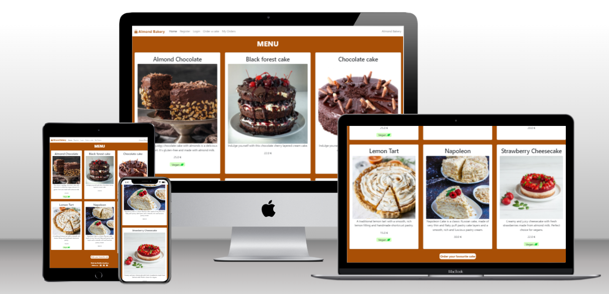

To see the live app please follow this <a href="https://almond-bakery-f92f9dfc55d0.herokuapp.com/" target="_blank"> link to the web app</a>

## User-Experience-Design

### The-Strategy-Plane

Site Goals
1)	For admin: Manage the menu displayed on the website, keep track of upcoming orders, edit, mark complete and delete if necessary.
2)	For customers: Make reservations in a simple way without the need to call or come to the bakery, to update or cancel their orders.

### Agile Planning
This project was developed using agile methodology by delivering small features in incremental sprints.
The user stories were assigned to epics, prioritized under the labels: Must have, should have, could have. 
"Must have" stories were completed first to ensure that core features were completed first to make the project ready to use. 

There was created a Kanban board using GitHub projects. 
It can be found here: <a href="https://github.com/users/Natalitta/projects/7" target="_blank">link to the project</a>

### Epics (Milestones):
There are 4 Epics (Milestones):

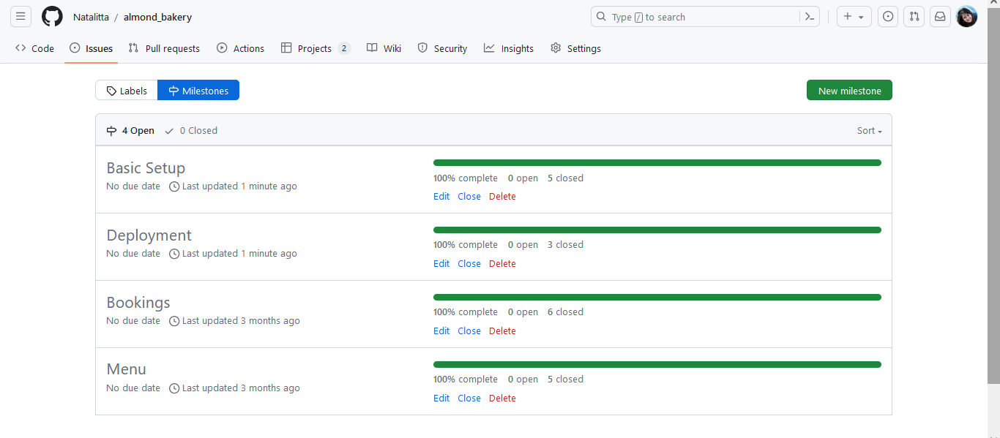

* Menu:
    * As a user, I'd like to view the menu so that I can make up my mind.
    * As an owner, I'd like to be able to edit the menu so that it is always up to date.
    * As an owner, I'd like to have a nice menu on the home page with beautiful pictures so that customers want to order my cakes.
    * As an owner, I'd like to be able to add menu items so that I can offer new options to my customers when available.
    * As an owner, I'd like to be able to delete menu items so that the menu is always up to date.

* Bookings:
    * As a user, I'd like to be able to place my order easily through the site so that I can order a cake quickly and easily.
    * As a user, I'd like to be able to view my orders so that I can check them.
    * As a user, I'd like to be able to delete my order so that I can save my time and not phone to cancel my booking.
    * As a user, I'd like to be able to edit my booking so that I can keep it relevant.
    * As an owner, I'd like to be able to mark the orders if I have already sent them so that I can track my delivery process.    
    * As an owner, I'd like to see all the information required from a customer so that I can deliver the right order.

* Basic Setup:
    * As an owner, I'd like to have the same navigation and footer for all my site pages so that users feel more comfortable.
    * As an owner, I'd like to have a home page with a menu and navigation, a button to place an order so that site is convenient to use and gives an opportunity to order straight away.
    * As an owner, I'd like to have access to menu items and bookings, all data so that I can view and manage them.
    * As an owner, I'd like to have links to my social media accounts so that I have more connections with my audience.

* Deployment:
    * As an owner, I'd like to have my site up and running so that customers can utilise it.
    * As an owner, I'd like the app to be tested so that I can be sure that everything works properly.
    * As a developer, I must write a README file and fill it with all details so that it gives all information about the website.

### The-Scope-Plane

•	Home page with bakery menu 
•	Drop-down navigation menu for mobile devices
•	Ability to perform CRUD functionality on Bookings 
•	Responsive Design - Site should be fully functional on all devices from 320px up

## The-Structure-Plane
### Features
### Menu USER STORIES 
    As an owner, I'd like to have a home page with a menu and navigation, a button to place an order so that site is convenient to use and gives an opportunity to order straight away.

Implementation:

#### Home page:

1)	Navigation Menu

The Navigation contains links for:

Home, Order Cake, My Orders and has allauth options.

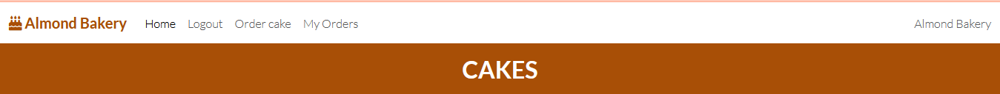

The following navigation items are available on all pages:

•	Home -> index.html - Visible to all

•	Login -> login.html - Visible to logged out users

•	Register -> signup.html - Visible to logged out users

•	Logout -> logout.html - Visible to logged in users

•	Order Cake -> booking.html - Visible to all 

•	My orders -> all_bookings.html – Visible to logged in users

The navigation menu is the same for all pages and displayed fully on big screens and drops down as a hamburger menu on smaller devices. It makes web application comfortably viewable on any device without taking up too much space on mobile devices.

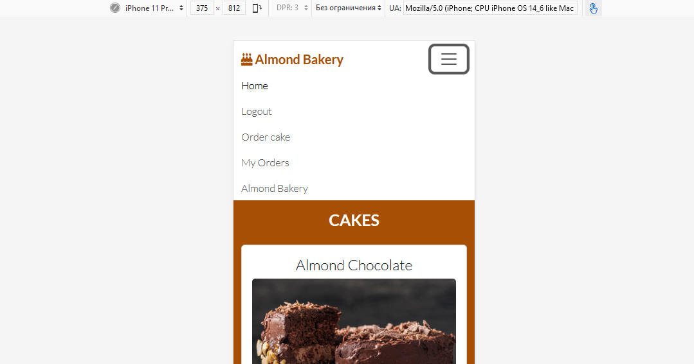

2)	Menu

The home page contains the menu of the bakery. This makes it clear from the first glance, what the purpose of the website is.

Under the cards with cakes there is a button 'Order cake'. This button allows the user to order a cake quickly without browsing the website.

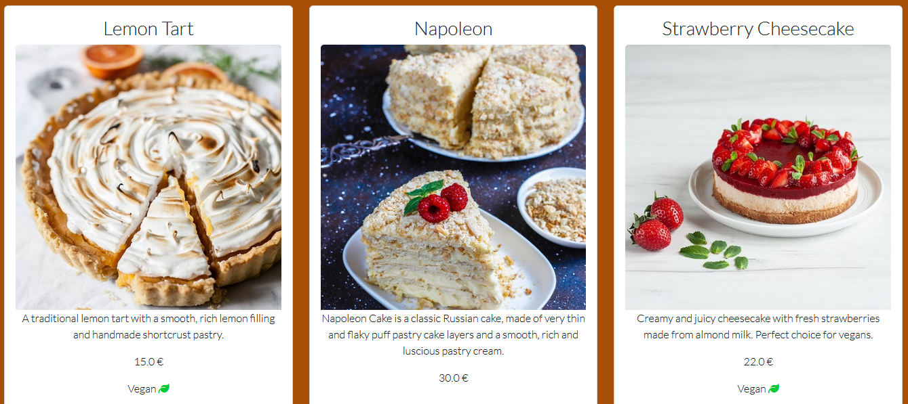

USER STORY - As an owner, I'd like to have links to my social media accounts so that I have more connections with my audience.

Implementation:

3) Footer

A footer at the bottom of the site contains social media links: Twitter, Facebook and Instagram. The links open in new tabs because they lead users away from the site. Users can follow the bakery on social media to see special offers.

4) Toasts

Custom toasts were added on successful login and logout which display messages to the user to enable them to see that the action completed successfully.

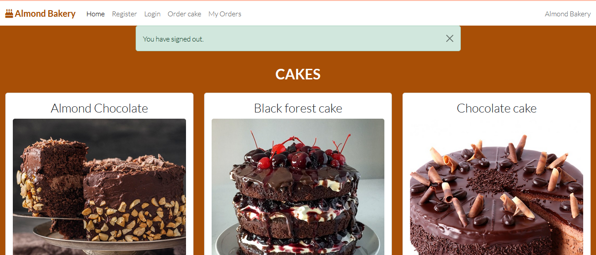

### Booking USER-STORIES
    As a user, I would like to be able to order a cake, edit or delete my bookings.

Implementation:

1) Order cake page

A booking page was implemented with a form that takes in the customer details and enables the user to easily make a booking through the UI.

Extensive logic was added to the form validation to ensure that only only a future date can be selected. 

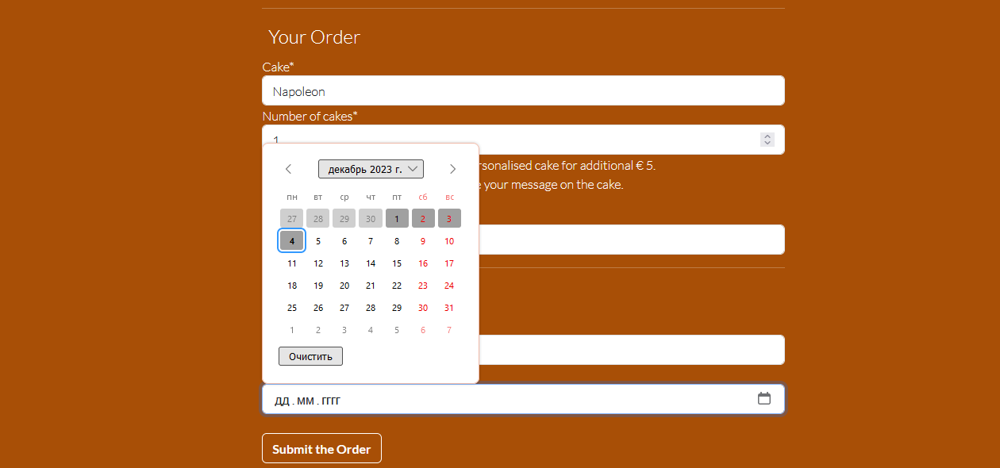

2) My orders page

My orders page was implemented to enable the user with ability to view their bookings and easily manage them.

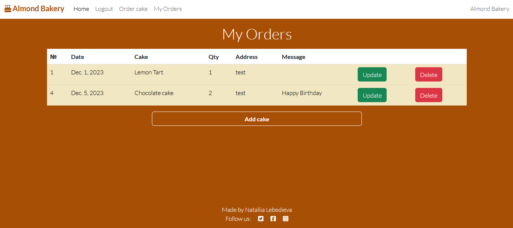

3) Edit order page

This page was implemented to enable the user with ability to edit their bookings.

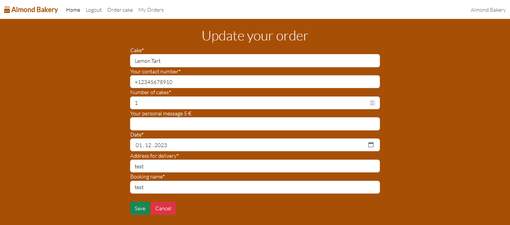

4) Delete confirmation page

This page was implemented to enable the user with ability to delete their bookings and ensure that they cannot delete an order by mistake.

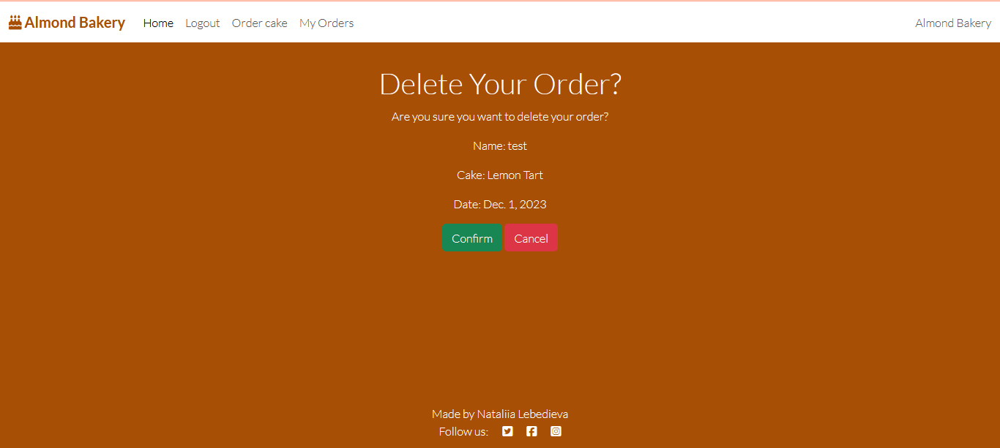

### Error Pages

404 Page

A 404 page has been implemented to display a custom Error page if a user navigates to a broken link.

The 404 page will allow the user to easily navigate back to the main website if they direct to a broken link / missing page, without the need of the browsers back button.

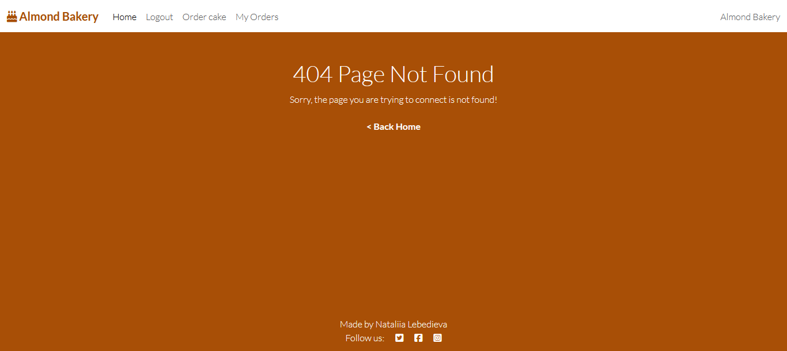

### The-Surface-Plane
### Design
#### Colour-Scheme

The main color scheme of the web app is brown (rgb(168, 79, 6)) and white navbar, menu cards and form fields. 

#### Typography

The Lato font is used throughout the site. This font is from google fonts and was imported into the style sheet.

#### Imagery

The images were taken from Unsplash and Freepic which are royalty free image sites.

### Technolgies

#### HTML

    The app was developed using templates with HTML as the main language.

#### CSS & Bootstrap

    The app was styled using an external CSS file and Bootstrap framework.

#### JavaScript

    JavaScript was used to set timeout for message alerts and redirect after deletion of an order.

#### Gitpod
    The app was developed using Gitpod IDE

#### GitHub
    The source code is hosted on GitHub

#### Git
    Used to commit and push code during the development of the web app

#### Font Awesome
    Used for icons throughout the site

#### Favicon

    favicon files were created at https://favicon.io/favicon-converter/

#### Python

    Python was the main programming language used for the application using the Django Framework.

    Python Modules:

        Django Class based views 
        Mixins 
        messages
        date
        timedelta

    External Python Modules:

        Django
        cloudinary
        crispy-forms
        gunicorn

## Testing
### Validator Testing
The application was tested to ensure that the code passes the official validators.

### HTML
The website was run through the w3 HTML Validator. Initially there were some errors found because of  a few stray tags, skipped level of headings, anchor tags inside button elements. All of these issues were solved and finaly the website passed validation.

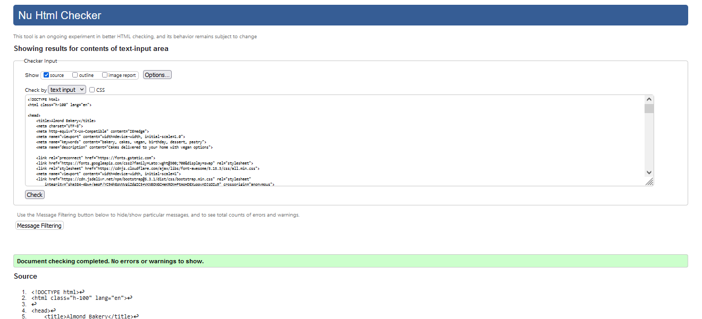

### CSS
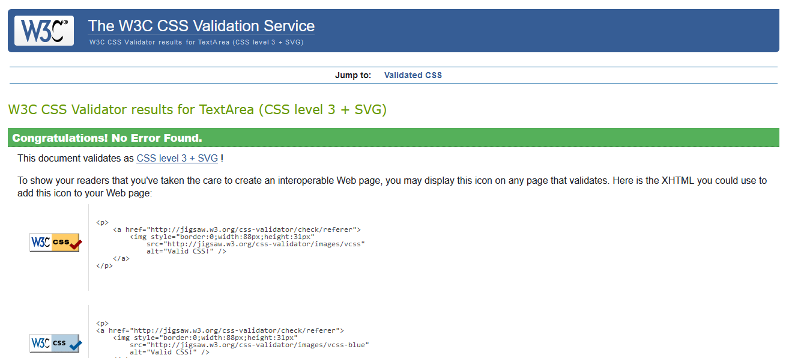

### JavaScript
JavaScript code was run through JSHINT javascript validator. There is very little JavaScript used so the website passed the validation without any errors.

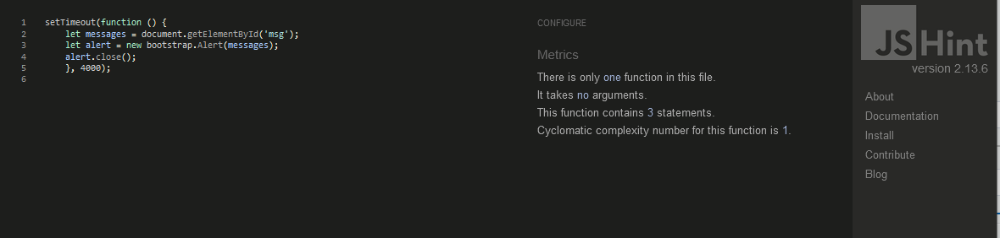

### Python
The web app pages were run through the official Pep8 validator to ensure all code was pep8 compliant. Some errors were shown due to too many empty lines (2 instead of 1), trailing space and too long lines. All the errors were resolved and code passed through validators. 

Only settings.py file didn't pass because of AUTH_PASSWORD_VALIDATORS being too long as they were auto generated by django. I did not  split these lines because the code is django auto generated.

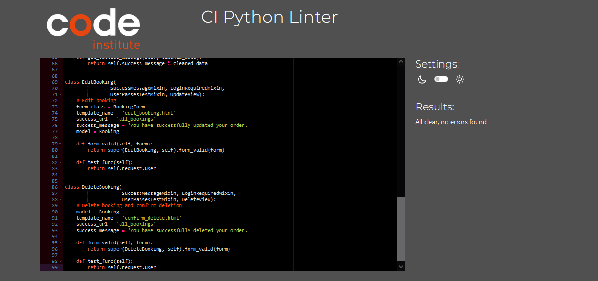

### Accessibility Testing

To test Accessibility the Wave tool was used.

Testing was focused to ensure the following criteria were met:

    All forms have associated labels or aria-labels so that this is read out on a screen reader to users who tab to form inputs.
    Color contrasts meet a minimum ratio as specified in WCAG 2.1 Contrast Guidelines.
    Heading levels are not missed or skipped to ensure the importance of content is relayed correctly to the end user.
    All content is contained within landmarks to ensure ease of use for assistive technology, allowing the user to navigate by page regions.
    All not textual content had alternative text or titles so descriptions are read out to screen readers.
    HTML page lang attribute has been set.
    Aria properties have been implemented correctly.
    WCAG 2.1 Coding best practices being followed.

    There were a few issues: missing language in the head section, missing aria-labels for the footer links presented by icons of social media. The issues were solved.

### Lighthouse Testing

Meta descriptions and keywords were added to boost the SEO to 100.

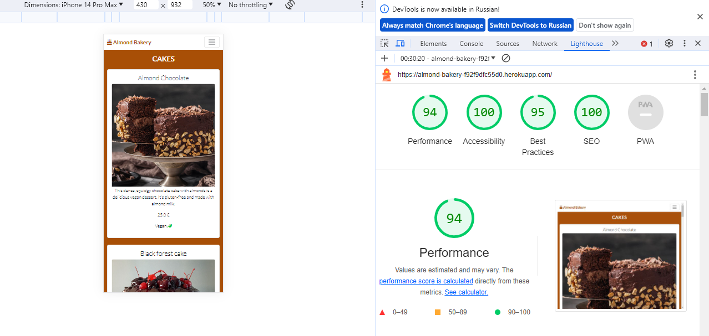

### Responsiveness

All pages were tested to ensure responsiveness on screen sizes from 320px and upwards as defined in WCAG 2.1 Reflow criteria for responsive design on Chrome, Edge, Firefox and Opera browsers.

Testing Steps:

    Open browser and navigate to Almond Bakery
    Open the developer tools (right click and select "inspect")
    Set to responsive and decrease width to 320px
    Set the zoom to 50%
    Click and drag the responsive window to maximum width

Expected:

    Website is responsive on all screen sizes and no images are pixelated or stretched. No horizontal scroll is present. No elements overlap.

Actual Result: As Expected

Result:  Pass

    Website was also tested for the following devices and no responsive issues were seen:

    Pixel 4A, Samsung Galaxy A51/71, iPhone Pro Max 14

## Functional Testing

### Authentication

Description: Ensure a user can sign up to the website

    Steps:

        Navigate to Almond Bakery and click Register
        Enter email, username and password
        Click Sign up

    Expected: Registration is successful, a user can log in.

    Actual: As expected

    Result: Pass

Description: Ensure a user can log in once signed up

    Steps:

        Navigate to Almond Bakery
        Enter login details from previous test case
        Click login

    Expected: User is logged in successfully and can view My orders page which is restricted.

    Actual: As expected

    Result: Pass

Description: Ensure a user can sign out

    Steps:

        Login to the website
        Click the logout button
        Click confirm on the logout confirmation page

    Expected: User is logged out successfully

    Actual: As expected

    Result: Pass

### Booking Forms

Description: Ensure a new booking can be created.

    Steps:

        Navigate to page Order a cake.
        Enter the following:
            Name: Natie
            Contact number: A phone number
            Cake: Select any from drop down menu
            Number items: 1
            Adress: Any address
            Date: Any future date
        Click Create

    Expected: Form successfully submits and redirects to My orders page.

    Actual: As expected

    Result: Pass

Description: Ensure a booking can be edited.

    Steps:

        Navigate to My orders page - Login if prompted.
        Enter updated info
        Click Create

    Expected: Form successfully submits and redirects to My orders page.

    Actual: As expected

    Result: Pass

Description: Ensure user can successfully delete a booking.

    Steps:

        Login as a user with a booking or create a new booking
        Click the My orders nav link
        Click the delete button on a booking
        Click the confirm button on the delete confirmation page

    
    Expected: Booking is successfully deleted and redirects to My orders page

    Actual: As expected

    Result: Pass

### Menu

Description: Ensure an admin have access to create menu items

    Steps:

        Add /admin to the website url
        Login using admin details
        Navigate to Menu items
        Click on Add menu item
        Enter the following details:
            Name: Test Cake
            Description: Test
            Price: 20.00
            Checkbox: Vegan
        Click Create

    Expected: A new menu item is sucessfully added and can be viewed on home page.

    Actual: As expected

    Result: Pass

Description: Ensure a menu can be updated

    Steps:
        Add /admin to the website url
        Login using admin details
        Navigate to Menu items
        Click on the menu item to be updated
        Change the information
        Click Save

    Expected: Menu item has been updated and new info is displayed on the home page.

    Actual: As expected

    Result: Pass

Description: Ensure a menu item can be deleted

    Steps:

        Add /admin to the website url
        Login using admin details
        Navigate to Menu items
        Click on the menu item to be deleted
        Click Delete

    Expected: Menu item has been deleted and cannot be seen on the home page

    Actual: As expected

    Result: Pass

### Navigation Links

Testing was performed to ensure all navigation links on the respective pages, navigated to the correct pages as per design. This was done by clicking on the navigation links on each page.

    Home -> index.html
    Login -> login.html
    Register -> signup.html
    Logout -> logout.html
    Order Cake -> booking.html
    My orders -> all_bookings.html

All navigation links directed to the corect pages as expected.

#### Footer

Testing was performed on the footer links by clicking the font awesome icons and ensuring that the twitter, facebook and instagram icons opened websites in new tabs.
Actual: As expected

Result: Pass

### Negative Testing

Tests were performed on the booking page to ensure that:

    A customer cannot book a date in the past or today
    A customer cannot create a booking entering letters or symbols in phone number field
    A customer cannot edit a booking or delete a booking if not logged in
    Forms cannot be submitted when required fields are empty

### Bugs

There was a bug with using classes for buttons and a tags due to Bootstrap, some of them do not work unless changed into ids, I tried to specify them more precisely mentioning there parent element but it didn't work either. So I added style attribute to a few anchor tags to avoid using an id  multiple times.